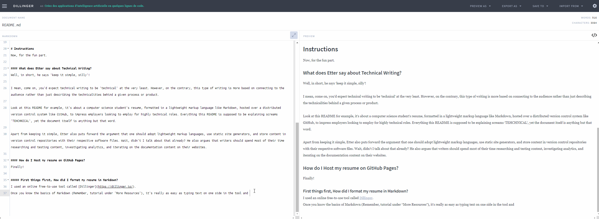
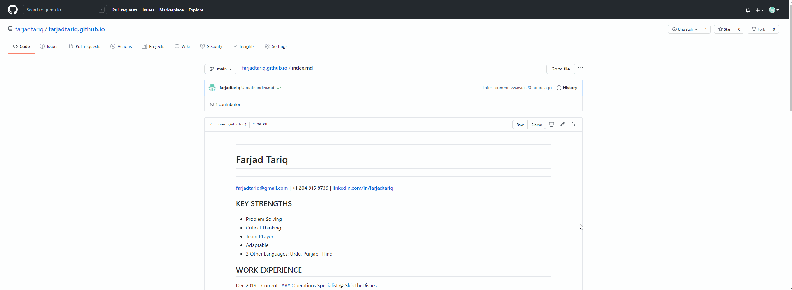

---
# How to Host an Online Resume (and learn some fundamentals of Technical Communication along the way)
---

## Purpose
The purpose of this README is to describe how to host an attractive resume online on GitHub Pages , for absolutely FREE. The task however is quite simple, so to make this read more worth your while , it'll also give an overview of the concepts of Andrew Etter's bestselling book *Modern Techncical Writing* by relating them to the steps required to host a resume. 

## Audience
The audience for this README is intended to be other CS students like myself. Think of this work as 'by the people for the poeple'. 

## Prerequisites
For this to work: 
- first you need a resume, 
- second your resume needs to be formatted in Markdown (a Lightweight Markup Language). 

If you have a resume already AND it's formatted in Markdown, bravo, you're way ahead of me when I started. If you have a resume, and it's not formatted, worry not, I've not only linked a great Markdown tutorial under "More Resources" at the end of this README, but I'll also be going over what Markdown editor I used to format my resume.
If you don't have a resume at all however.. then I suggest you make one right away because that's a great step towards gaining employment. 

# Instructions
Now, for the fun part.

### What does Etter say about Technical Writing?
Well, in short, he says 'keep it simple, silly'! 

I mean, you'd expect technical writing to be 'technical' at the very least. However, on the contrary, this type of writing is more based on connecting to the audience rather than just describing the technicalities behind a given process or product. 

Take this README for example, it's about a computer science student's resume, formatted in a lightweight markup language like Markdown, hosted over a distributed version control system like GitHub, to impress employers looking to employ for highly technical roles. Everything this README is supposed to be explaining screams 'TEHCHNICAL', yet the document itself is anything but that word. 

Apart from keeping it simple, Etter also puts forward the argument that one should adopt lightweight markup languages, use static site generators, and store content in version control repositories with their respective software files. Wait, didn't I talk about that already? It's important to understand still why he supports this notion. He also argues that writers should spend most of their time researching and testing content, investigating analytics, and iterating on the documentation content on their websites.  

#### How did I format my resume in Markdown? and why you should do it too.
Lightweight Markup Languages like Markdown are not only easy to write using any generic text editor, but its also easy to read them in their raw form. I used an online free-to-use tool called [Dillinger](https://dillinger.io/).
Once familiar with Markdown, it's really as easy as typing text on one side in the tool and seeing that text come to life on the other side showing the live preview.

The GIF above shows a snapshot of the editor while I was writing the statemtents in the above paragraph. Pretty cool I must say!

After you're done formatting just click on **EXPORT AS** located at the top right corner of the tool and then select Markdown. It will allow you to choose where you want to save the file.

### Why host a resume online and use Github?
An online resume hosted on GitHub gives you an edge on others as it shows potential employers that you're familiar with the industry and what it has to offer. Version control systems like Git not only provide a platform for multiple people to work on the same files, but it also keeps record of the changes. And, GitHub Pages allows you to display those files as static sites.  Static sites are portable, secure and fast. Unlike their dynamic counterparts, which bring with them the complicacies of databases and server-side applications on the backend.

Therefore, as you can see this allows more people to be involved in the process and contribute effectively, since expert knowledge on tools being used to generate the documentation is not required. Also, it keeps track of who changed what and when, and you can easily revert changes and go back to previous states. 

#### How do I set myself up on GitHub and host my resume there?
GitHub at first glance seems like a daunting place to get familiar with. Atleast, I, for one, thought so. But turns out, it's not. As far as our task is concerned GitHub offers a free public repository with each account, this repository is where we will be storing our Markdown formatted resume. From there, using GitHub pages and a tad bit of Jekyll, we will turn it into a easy access webpage. 

##### How I created a GitHub account
 - Go to [GitHub](https://github.com/)
 - Sign Up

##### How I created a public repository
Once you've signed up and are signed in, the top right corner should have a '**+**' sign, click on it, and select '**New repository**'.

In the new form, all you have to do is:
- Enter a name: For the sake of this assignment, I suggest using '*yourusername*.github.io', since anything else might not be compatible with GitHub Pages.
- Make sure to select 'Public'
- Check mark the three points at the end under 'Intialize the repository with': They are for good reason and will only help you
- Click on **Create repository**

And, voila, you now have a public repository.

##### How I uploaded my resume
In you repository:
- Click on **Add file**
- From the dropdown menu, click on **Upload files**
 
In the new page, uploading your Markdown formatted resume should be a breeze, since you can literally drag and drop that stuff. At the end, just click on **Commit changes**.

And, that's it. You now have a resume uploaded on a public repository.

Check out mine!

##### How I generateed the static site and added a theme to the resume
In your repository:
- Go to **Settings**
- Scroll down till the section '**GitHub Pages**' appears
    - If Github Pages isn't enabled, first do so 
    - Then, click on **Choose a theme**: Find a theme you would like showing your resume off with 
    - Click **Select theme** 

You just used Jekyll to do this, so if in case in the future you decide you want a custom theme or template, that's what you would want to look into. 

And now, you have a *beautiful* online resume that can be accessed through the weblink.

## More Resources

1. Andrew Etter's [Modern Technical Writing](https://www.amazon.ca/gp/product/B01A2QL9SS/ref=ppx_yo_dt_b_d_asin_title_o00?ie=UTF8&psc=1)
2. [Markdown Guide](https://www.markdownguide.org/getting-started)
3. [Other Markdown Editors](https://www.oberlo.ca/blog/markdown-editors)
4. [Building Static Sites with Jekyll](https://programminghistorian.org/en/lessons/building-static-sites-with-jekyll-github-pages)

## Authors and Acknowledgments
This project was created for a University course (*Technical Communication in Computer Science*) by Farjad Tariq.

I would like to to thank the members of Fantastic Five (-1) for their valuable feedback, their support is what led to the completion of this project. 

## FAQs

1. Why is Markdown better than a word processor?
    -  Markdown is simple and to the point. It can also be easily translated into other formats to use over the web, unlike .doc files created by the processors.
2. What weblink is used to access my resume?
    - The weblink is '*yourusername*.github.io'. If you're having trouble with that, go to **Settings**, scroll down till the section '**GitHub Pages**' appears, and click on the link where it says 'Your site is published at'.
